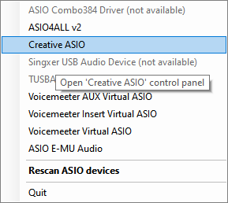

# ASIO-Settings-Utility
A small utility that runs in the tray. Allows you to quickly open the control panel for any ASIO device in the system.

The utility notifies if the device is not available or does not have a settings panel. The program has an option to rescan devices, which eliminates the need to restart the application when new devices appear in the system.

